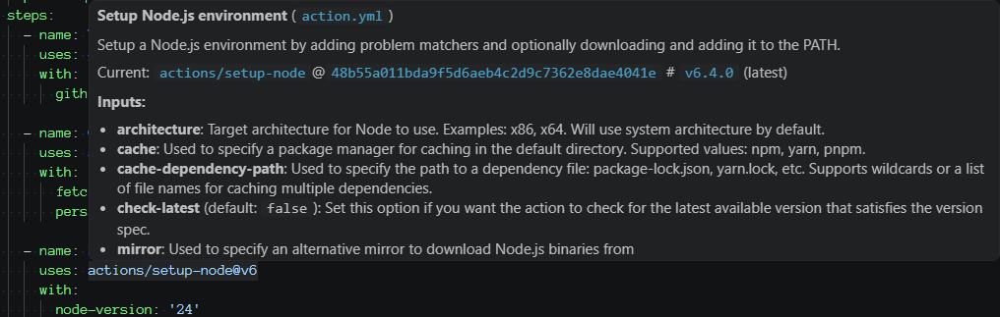
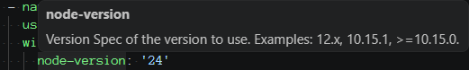
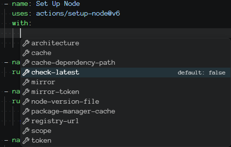

# Withcraft

Write GitHub Actions workflows without keeping an `action.yml` tab open. Withcraft is a Visual Studio Code extension
that brings action inputs, outputs, defaults, deprecations, and version info into the workflow file you are editing.

## Why Withcraft

- **Action metadata in context.** Hover any `uses:` for the action description, declared inputs and outputs, and
  current-vs-latest version information.
- **Input help where mistakes happen.** Hover a `with:` key for its description, required status, default value, and
  deprecation notice.
- **Completion for workflow wiring.** Complete undeclared `with:` inputs (required first) and declared
  `steps.<id>.outputs.*` references as you type.

Works with public GitHub, GitHub Enterprise Server, local actions, and reusable workflows.



## Quick Start

1. Install **Withcraft** (`goeselt.withcraft`) from the Visual Studio Code Extensions view.
2. Open a workflow file under `.github/workflows/`.
3. Hover any `uses:` reference or any key inside a `with:` block.

Example:

```yaml
- uses: actions/setup-node@v6
  with:
    node-version: 24
```

Hovering `actions/setup-node@v6` shows the action description, resolved version, and a summary of its declared inputs
and outputs.

Hovering `node-version` shows the input description, whether it is required, and its default value.



Pressing completion (`Ctrl+Space`) inside the `with:` block suggests the remaining undeclared inputs of the action.
Pressing completion after `steps.<id>.outputs.` suggests the declared outputs of that step.



## What You Get

### Hovers for actions and inputs

`uses:` hovers show the action name, description, declared inputs and outputs, and resolved version. When a newer tag is
available, Withcraft shows the latest version beside the version you currently use.

`with:` hovers explain individual inputs, including required status, defaults, and deprecation notices from the action
metadata.

### Completions for workflow files

Inside a `with:` block, Withcraft suggests inputs that are not already present, with required inputs first. In
expressions like `steps.build.outputs.`, it suggests declared outputs from the referenced action step.

### Local, remote, and reusable workflow metadata

Remote action metadata is resolved through the configured GitHub hosts and cached in memory to keep API usage low. Local
actions referenced with `./...` are read straight from the workspace so edits are reflected immediately. Reusable
workflow calls are supported for both remote references and local `.github/workflows/*.yml` files.

### Feature summary

- Hover on `uses:` shows the action name, description, declared inputs summary, and resolved version.
- `uses:` hovers can also show declared outputs; input and output sections can be toggled independently.
- Hover on `with:` input keys shows description, required status, default value, and deprecation notice.
- Hover on a `with:` key the action does not declare warns about the undeclared input (typo detection).
- Completion inside `with:` blocks suggests undeclared inputs; required inputs appear first.
- Completion after `steps.<id>.outputs.` suggests declared outputs for action steps with an `id`.
- Skips inputs already present in the block to avoid duplicates.
- Caches remote action metadata to keep GitHub API usage low.
- Reads local actions from the workspace without caching so edits are reflected immediately.
- Supports sub-action references such as `github/codeql-action/upload-sarif@v4`.
- Supports reusable workflow references, including remote (`owner/repo/.github/workflows/file.yml@ref`) and local
  (`./.github/workflows/file.yml`) calls.
- Skips Docker image references (`docker://...`) by design.

## Settings

| Setting                             | Default          | Description                                                                                 |
| ----------------------------------- | ---------------- | ------------------------------------------------------------------------------------------- |
| `withcraft.enabled`                 | `true`           | Enable Withcraft hovers and completions.                                                    |
| `withcraft.hover.enabled`           | `true`           | Enable hovers for `uses:` entries and `with:` input keys.                                   |
| `withcraft.hover.uses.enabled`      | `true`           | Enable hovers on `uses:` entries. Disable if another extension already provides this hover. |
| `withcraft.hover.inputs.enabled`    | `true`           | Show declared inputs in `uses:` hovers.                                                     |
| `withcraft.hover.outputs.enabled`   | `true`           | Show declared outputs in `uses:` hovers.                                                    |
| `withcraft.completion.enabled`      | `true`           | Enable completion for `with:` inputs and step outputs.                                      |
| `withcraft.githubHosts`             | `["github.com"]` | GitHub hosts to query for remote action metadata, in order.                                 |
| `withcraft.github.requestTimeoutMs` | `5000`           | Maximum time to wait for each GitHub API or metadata request.                               |
| `withcraft.logging.level`           | `"info"`         | Controls diagnostic output in the Withcraft output channel.                                 |
| `withcraft.cache.maxEntries`        | `1000`           | Maximum number of remote action metadata entries kept in memory.                            |

Example for a mixed public and GitHub Enterprise Server setup:

```json
"withcraft.githubHosts": [
  "github.com",
  "github.company.example"
]
```

For `github.com`, Withcraft calls `https://api.github.com`. For GitHub Enterprise Server hosts, it calls
`https://<host>/api/v3`.

## Diagnostics

Use **Withcraft: Show Output** or open **Output: Withcraft** to inspect resolver decisions. Use **Withcraft: Refresh
Metadata** to re-fetch metadata for the active document, or **Withcraft: Clear Cache** to discard all cached remote
metadata and cached token lookups when results appear stale. Tokens stored in secret storage are not affected; remove
them with **Withcraft: Remove GitHub Token**. Log lines are structured for copy/paste debugging:

```text
2026-06-16T08:42:00.000Z INFO resolve.selected {"id":"r7","host":"github.com","hostIndex":0,"durationMs":84,"source":{"host":"github.com","owner":"actions","repo":"setup-node","path":"action.yml","ref":"v6"}}
```

The default `info` level logs compact final host decisions. Set `withcraft.logging.level` to `debug` when investigating
cache behavior, resolution starts, or per-host outcomes.

## Requirements

- Visual Studio Code `1.120.0` or newer.
- Network access to the configured GitHub hosts.
- Public access to referenced action repositories, or a configured token for private ones.

Use the **Withcraft: Set GitHub Token** command to store a token per host, and **Withcraft: Remove GitHub Token** to
delete one. Tokens are stored in VS Code's secret storage and are never written to settings files.

If no Withcraft token is stored for a host, Withcraft falls back to `gh auth token --hostname <host>`, which only
returns a token for hosts you have authenticated to. For `github.com` only, it additionally tries the
`WITHCRAFT_GITHUB_TOKEN`, `GITHUB_TOKEN`, and `GH_TOKEN` environment variables. These environment variables are never
sent to other hosts, so a workspace cannot redirect them to an arbitrary endpoint.

## Contributing

See [CONTRIBUTING.md](CONTRIBUTING.md) and [LICENSE](LICENSE).
